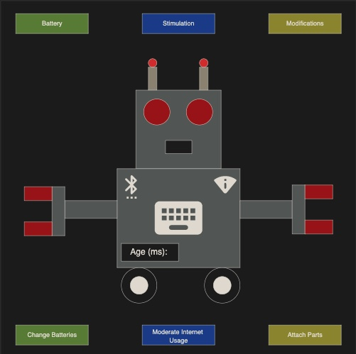

# Tomagotchi

# Wire-Frame



``` js

/* User Stories */


/* Friendroid begins with brown box on the screen and a button under that says 'open package' */

/* more details */

// Friendroid begins with brown box on the screen -> a div container will be used to create a brown box with the class of box, this will eventually morph into the robot
// a button under that says 'open package' -> under the brown box div will be a button that says 'open package'

// === SECTION === //

/* The user clicks the 'open package' button, and the box image switches out with the first form of our robo friend, its head. This will also begin the age timer, which will run throughout the game. */

/* more details */

// the user clicks the 'open package' button and the box image switches out with the first form of our robo friend, its head -> clicking the button will remove the class of box and assign the class of robot-head, which will change the image
// This will also begin the age timer, which will run throughout the game. -> a time tag with the class of 'age' will be added as a child to the div that holds the robot. A time method will be added that keeps track of time in seconds. 

// === SECTION === //

/* In addition, 3 meters for Battery, Stimulation, and Modifications will appear at the top of the screen. As time passes, the battery meter will drain and the stimulation meter will fill. The modifications meter will only fill when the player adds modifications. */

/* more details */

// 3 meters for battery, stimulation and modifications will appear at the top of the screen -> above the box/robot, a section tag with class "meter-container" will hold 3 div objects each with the the class of "meter" and an ID
// as time passes, the battery meter will drain -> the battery div will start at full and decrease as time goes on
// and the stimulation meter will fill -> the stimulation div will start at empty and increase as time goes on
// the modifications meter will only fill when the player adds modifications -> the modifications div will start at empty and increase with player input

// === SECTION === //

/* 3 New buttons will also appear on the bottom of the screen for Change Batteries, Moderate Internet Usage, and Attach Parts. When the user presses these buttons, they will fill the battery meter, reduce the stimulation meter, and fill the modifications meter. */

/* more details */

// 3 New buttons will also appear on the bottom of the screen for Change Batteries, Moderate Internet Usage, and Attach Parts -> a section tag below the 'open package' button will be created with a button tag for each listed category along with the class of button and an ID
// they will fill the battery meter -> upon user interaction, this button will refill battery meter by 50%
// reduce the stimulation meter -> upon user interaction, this button will reduce the stimulation meter by 50%
// fill the modifications meter -> upon user interaction, this button will increase the modifications meter by 33%

// === SECTION === //

/* Each action takes time, and only one action can be in progress at any point. The goal is to prevent the battery from draining completely, and prevent stimulation from filling completely. To advance to the next form, the player will have to fill the modification meter. */

/* more details */

// Each action takes time, and only one action can be in progress at any point -> pressing battery will take 6 secs, moderate will take 4 secs, and attach will take 8 secs. while any action is in process, all buttons will be disabled
// The goal is to prevent the battery from draining completely, and prevent stimulation from filling completely -> if the battery reaches 0%, or stimulation reaches 100%, the game ends
// To advance to the next form, the player will have to fill the modification meter -> when modifications reaches 100%, a new class of "robot-body" will be applied to the box/robot div and "robot-head" will be removed

// === SECTION === //

/* When the modification meter is full, the robot will move on to its second form. Visually, the robot will have more parts added to the body. The robot's needs will also be harder to balance during the second form. */

/* more details */

// When the modification meter is full, the robot will move on to its second form. Visually, the robot will have more parts added to the body -> the "robot-body" class will include styling that adds an antenna, body, and one arm to the robot character
// The robot's needs will also be harder to balance during the second form. -> the rate of increase for pressing the battery button is reduced to 40%, the decrease for moderate is reduced to 33%, and the increase for modifications is reduced to 25%

// === SECTION === //

/* The player can fill the modification meter again and send the robot to its third form. Again, more parts will be added visually to the robot and fulfilling its needs will be harder to balance than the last form. */

/* more details */

// The player can fill the modification meter again and send the robot to its third form -> the "robot-body" class will be replaced with the "robot-full" class on the box/robot div
// more parts will be added visually to the robot -> the robot will now have both arms, wheels, and icons for wifi and bluetooth added visually
// fulfilling its needs will be harder to balance than the last form -> battery input reduced to 35%, moderate is reduced to 25%, and modifications is reduced to 20%

// === SECTION === //

/* If the player fills the modification meter a 3rd time, they can upgrade it to the 4th form. A new complete version of the robot will appear along with a congratulations message. This will end the game in a win.  */

/* more details */

// If the player fills the modification meter a 3rd time, they can upgrade it to the 4th form. A new complete version of the robot will appear -> once the modification meter is full "robot-full" class will be replaced with "robot-complete" and the timer will be stopped
// a congratulations message. This will end the game in a win -> a congratulations p tag with class of "win" will be added that shows text proclaiming "you did it!". The timer will also be stopped

/* === Milestones TODO === */
// create HTML layout - done
// create game object -> round, age, colors, battery, stimulation, modifications - done
// event listener on button to begin game - done
// create brown box and robot-head objects (in css) - done
// create timer - done
// create meters -> battery drains over time, stimulation fills over time, modifications fills with user input - done
// methods for resepective buttons to fill battery, reduce stimulation, and fill modifications - done
// create failure condition -> game ends if battery = 0% or stimulation = 100% - done
// create round setup -> increase difficulty - done
// check round number and end game after round 3 - done
// find pictures for other robot forms and create mechanism to switch them out depending on the round - done
// add field to change name - done 
// add instructions to beginning - done
// add game over features for both winning and losing - none
// animate frienDroid - none

/* === Feature Creep === */

// meters will fill and drain color based on the percentage they are full
// balance the values for all meters/buttons
// intro screen will display text (maybe animated like a typewriter) to explain the rules of the game - done
// add button that resets game to opening state (open package button)